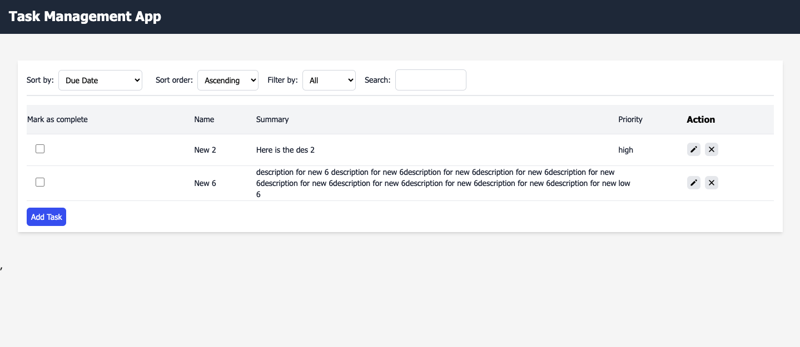
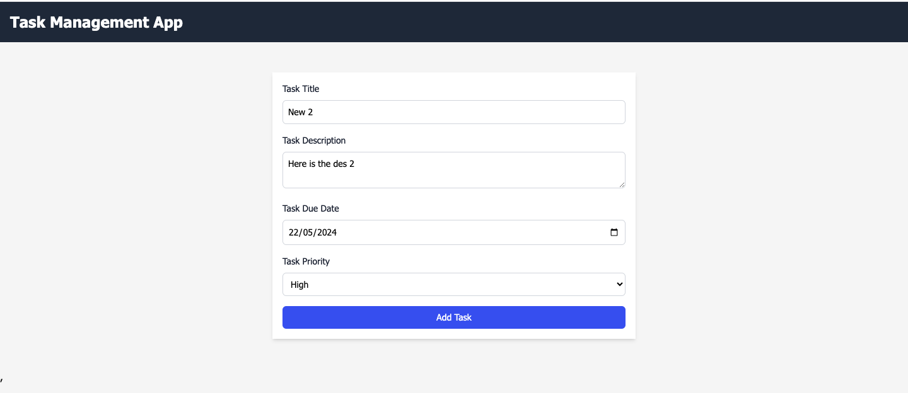
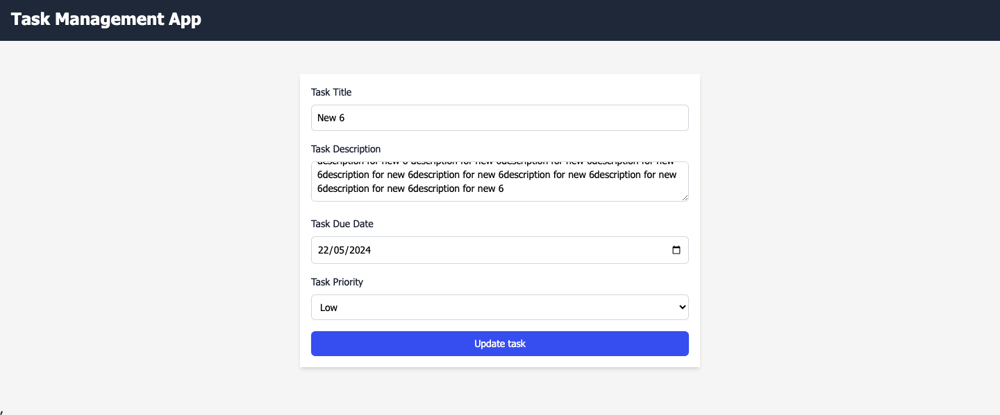

# Task Management App

In the project directory, you can run:
## Instructions to start the app

In the project directory, you can run:

### `npm install`

To install all the depencdencies required for the app

### `npm start`

Runs the app in the development mode.\
Open [http://localhost:3000](http://localhost:3000) to view it in your browser.

The page will reload when you make changes.\
You may also see any lint errors in the console.

### Landing page

Here in landing page as you can see there are filters and a table list
Filters:
Sort by : It has three options Due Date , priority, completed status to sort the list with these options
Sort order: It has two options Ascending or descending
Filter by:  It has 3 options as All, Completed, Incompleted , it filters accordingly
Search : It search using the task title 

## Task List

This is the task list in landing page, where you can view all of your tasks.

### Adding a Task

To add a new task, click on the "Add Task" button in the bottom left corner of the page.

### Completing a Task

To mark a task as complete, click on the checkbox next to the task.

### Deleting a Task

To delete a task, click on the trash can icon next to the task.

### Editing  a Task

To edit a task, click on the edit icon next to the task.

### Add task page

Here are its fields description
title: The title of the task.
description: The description of the task.
dueDate: The due date of the task.
priority: The priority of the task.
Add task button : Saves the data 

### Update task page

Here are its fields description
title: The title of the task.
description: The description of the task.
dueDate: The due date of the task.
priority: The priority of the task.
Update task button : Saves the data 

All the fields will be prefilled 

